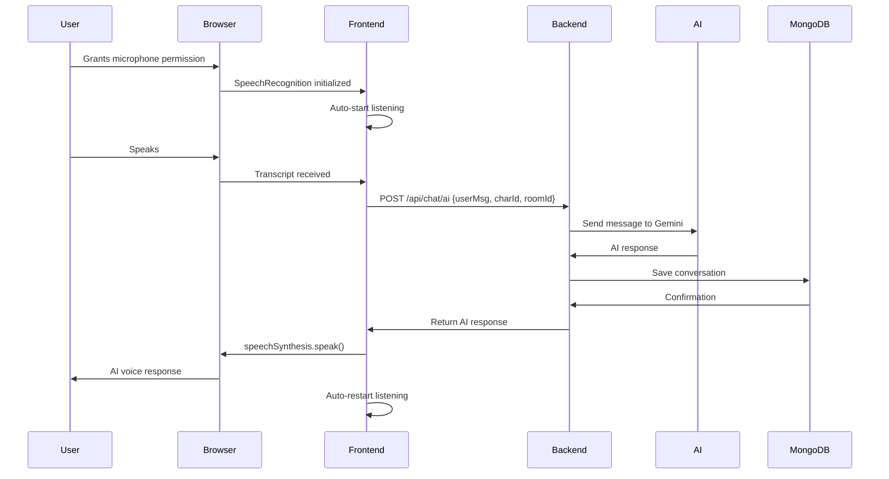
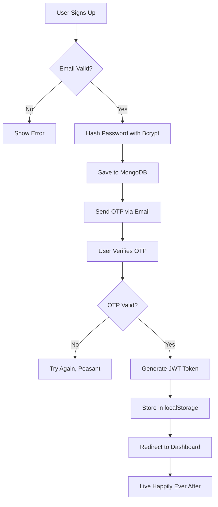

# 🎤 SpeakEZ

> _"Because reading documentation is so 2010. Why not **talk** to your AI overlords instead?"_

[](https://reactjs.org/)
[](https://nodejs.org/)
[](https://www.mongodb.com/)
[](https://tailwindcss.com/)

---

## 📖 What Even Is This?

Welcome to **SpeakEZ** - the revolutionary language learning platform where you can _literally_ have conversations with AI characters. Because apparently, we've reached peak civilization where talking to imaginary AI friends is not only acceptable, it's _educational_.

This isn't just another "learn English" app. Oh no. This is a full-stack, voice-activated, AI-powered, buzzword-compliant masterpiece that lets you:

- 🗣️ **Have voice conversations** with AI characters (yes, they talk back)
- 📚 **Practice vocabulary** like it's 1999, but with more JavaScript
- 🎭 **Create custom AI characters** because the default ones weren't weird enough
- 💬 **Get real-time feedback** on your grammar (prepare to be humbled)
- 🧠 **Track your progress** with a dashboard that probably knows more about you than you do

---

## 🏗️ Architecture (AKA "The Stack")

### Frontend: _Where Dreams Become Components_

```
React 19.0.0 (because 18 was too mainstream)
├── Vite (blazingly fast™)
├── Tailwind CSS (utility classes go brrr)
├── React Router (for that SPA goodness)
├── Axios (because fetch is too vanilla)
├── Firebase (authentication, because rolling your own is for masochists)
├── Lucide Icons (pretty shapes)
└── Speech Recognition API (the browser does the heavy lifting)
```

**Key Features:**

- Voice recognition that _actually works_ (most of the time)
- Circular animations that pulse with your existential dread
- A navbar that follows you everywhere (like your responsibilities)
- More components than a Boeing 747

### Backend: _The Dark Arts Section_

```
Express.js (good ol' reliable)
├── MongoDB + Mongoose (NoSQL because who needs relationships anyway)
├── JWT (tokens, not the crypto kind... unless? 👀)
├── Bcrypt (your passwords are safe... probably)
├── Google Generative AI (because OpenAI wasn't giving student discounts)
├── Nodemailer (spam your users professionally)
└── PM2 (keeping the dream alive 24/7)
```

**Notable Mentions:**

- A whopping **4 route files** (we're practically microservices)
- **6 database models** (that's basically enterprise-level)
- Middleware that verifies you are who you say you are (trust issues much?)
- A `.env` file with more secrets than the CIA

---

## 🚀 Getting Started (Or: How I Learned to Stop Worrying and Love Node Modules)

### Prerequisites

Before you embark on this journey, ensure you have:

- **Node.js** (v16 or higher, because we live in the future)
- **MongoDB** (running locally or in the cloud, we don't judge)
- **A microphone** (duh, it's a _voice_ interface)
- **Patience** (not technically a dependency, but highly recommended)
- **A browser that supports Web Speech API** (basically anything that isn't Internet Explorer)

### Installation

#### 1. Clone This Beauty

```bash
git clone <your-repo-url>
cd speakEz-team
```

#### 2. Backend Setup (Server-Side Sorcery)

```bash
cd server
npm install

# Create a .env file and add your secrets
# (Don't worry, we won't tell anyone)
echo "MONGO_URI=your_mongodb_connection_string" > .env
echo "JWT_SECRET=your_super_secret_key" >> .env
echo "GEMINI_API_KEY=your_google_ai_api_key" >> .env
echo "EMAIL_USER=your_email@example.com" >> .env
echo "EMAIL_PASS=your_email_password" >> .env

# Start the server
npm run dev
```

The server will spawn at `http://localhost:5000` (or whatever PORT you set in .env)

#### 3. Frontend Setup (The Pretty Part)

```bash
cd ../client
npm install

# Configure Firebase (because Google wants your data)
# Edit src/Firebase.js with your Firebase config

# Fire it up!
npm run dev
```

The client will gracefully appear at `http://localhost:5173` (thanks, Vite!)

---

## 🎯 Features That'll Blow Your Mind (Or At Least Mildly Impress You)

### 🎤 Voice-Activated AI Chat

Talk to AI characters and they'll respond! It's like having imaginary friends, but with better grammar and infinite patience.

**Tech Stack:**

- Web Speech API (browser magic)
- Speech Synthesis (text-to-speech, because reading is hard)
- Real-time transcript display (so you can see what the AI _thinks_ you said)

### 🤖 Custom AI Characters

Create personalities! Make them:

- Professional interviewers
- Quirky conversationalists
- Grammar nazis (sorry, _enthusiasts_)
- Whatever your heart desires

### 📊 Progress Tracking Dashboard

Watch your skills improve with:

- Time spent per question/topic
- Difficulty-based analytics
- Chart.js visualizations (because pie charts make everything better)
- Stats that definitely don't lie

### 🔐 Authentication System

Because we can't just let _anyone_ talk to our AI friends:

- User registration with email verification
- JWT-based authentication (fancy tokens)
- Password reset via email (for when you forget... again)
- Bcrypt password hashing (your secrets are safe-ish)

### 📚 Learning Modules

- **Vocabulary Builder** - Learn words you'll never use in real life
- **Grammar Practice** - Discover all the ways you've been wrong
- **Pronunciation** - Let the AI judge your accent
- **Interactive Courses** - Structured learning paths

---

## 📁 Project Structure (For The Architecturally Curious)

```
speakEz-team/
│
├── client/                          # Frontend Kingdom
│   ├── src/
│   │   ├── components/              # React components galore
│   │   │   ├── pages/               # All the pages
│   │   │   │   ├── Dashboard.jsx    # The nerve center
│   │   │   │   ├── voiceInterface.jsx  # Where the magic happens
│   │   │   │   ├── Login.jsx        # Portal to enlightenment
│   │   │   │   └── ...              # More pages than a phonebook
│   │   │   ├── Navbar.jsx           # Always watching
│   │   │   ├── Footer.jsx           # The bottom feeder
│   │   │   ├── Aicharacter/         # AI personality factory
│   │   │   ├── Blog/                # Words about words
│   │   │   └── ...                  # 18 component folders later...
│   │   ├── App.jsx                  # The big boss
│   │   ├── Firebase.js              # Google's tentacles
│   │   └── main.jsx                 # Entry point
│   ├── index.html                   # Where it all begins
│   ├── package.json                 # Dependency hell manifest
│   └── vite.config.js               # Vite configuration
│
└── server/                          # Backend Lair
    ├── controllers/                 # Business logic central
    │   ├── chat.js                  # Chat orchestrator
    │   ├── roleplay.js              # AI personality handler
    │   └── ...                      # More controllers
    ├── models/                      # Database schemas
    │   ├── user.js                  # User entity
    │   ├── aiChar.js                # AI character definition
    │   ├── chat.js                  # Conversation storage
    │   ├── room.js                  # Chat room logic
    │   └── ...                      # OTP, password reset, etc.
    ├── Routes/                      # API endpoints
    │   ├── userRoute.js             # User operations
    │   ├── chatRoute.js             # Chat endpoints
    │   ├── aiCharRoute.js           # Character CRUD
    │   └── userDataRoute.js         # User data management
    ├── Middlewares/                 # The gatekeepers
    │   └── auth.js                  # JWT verification
    ├── app.js                       # Server orchestrator
    ├── connect.js                   # MongoDB connector
    └── package.json                 # More dependencies
```

---

## 🎨 Key Components Breakdown

### `voiceInterface.jsx` - The Crown Jewel

551 lines of pure, unadulterated voice interaction genius. Features include:

- **Continuous Speech Recognition** - It never stops listening (like your mom)
- **Text-to-Speech Synthesis** - Because the AI has opinions and _will_ share them
- **Animated Pulsing Circle** - Mesmerizing visuals for your ADD brain
- **Multiple Color Schemes** - Blue, purple, green, pink (revolutionary, I know)
- **Microphone Permission Handling** - Politely asks before invading your privacy

### `Dashboard.jsx` - Mission Control

Your personal command center featuring:

- Profile management
- Learning statistics
- Course access
- Character creation
- Basically your entire digital life

### Chat System - The Conversation Engine

**Database Schema:**

```javascript
Room {
  roomId: String,      // Unique room identifier (nanoid ftw)
  userId: ObjectId,    // Who's talking
  charId: String       // Who's listening
}

Chat {
  roomId: String,      // Which room
  userMsg: String,     // What you said
  charMsg: JSON        // What AI responded
}
```

**API Flow:**

1. User hits `/api/chat` → Creates room with nanoid(10) identifier
2. User sends message to `/api/chat/ai` → Routes to Google Generative AI
3. AI responds → Saved to MongoDB → Spoken back via Speech Synthesis
4. Rinse, repeat, become fluent (hopefully)

---

## 🔧 Environment Variables (The Secret Sauce)

### Server (.env)

```env
# Database
MONGO_URI=mongodb://your-connection-string

# Authentication
JWT_SECRET=your-super-duper-secret-key-that-nobody-knows

# AI Configuration
GEMINI_API_KEY=your-google-generative-ai-key

# Email Service (for password resets and verification)
EMAIL_USER=your-email@gmail.com
EMAIL_PASS=your-app-specific-password

# Server Configuration
PORT=5000  # Or whatever port makes you happy
```

### Client (Firebase Config)

Edit `client/src/Firebase.js`:

```javascript
const firebaseConfig = {
  apiKey: "your-api-key",
  authDomain: "your-app.firebaseapp.com",
  projectId: "your-project-id",
  storageBucket: "your-app.appspot.com",
  messagingSenderId: "123456789",
  appId: "your-app-id",
};
```

---

## 🎭 How It Actually Works (The Technical Deep Dive)

### Voice Interaction Flow



### Authentication Flow



---

## 🐛 Known Issues (AKA "Features")

- **Speech Recognition Sometimes Stops** - Solution: Have you tried turning it off and on again?
- **Hardcoded localhost URLs** - Production deployment? What's that?
- **No error boundaries** - If it crashes, it crashes spectacularly
- **Mixed auth strategies** - Firebase for frontend, JWT for backend (we like variety)
- **That one `userId` typo in chat.js line 16** - It says `userId` but uses `req.user` (oops)

---

## 🚢 Deployment (Venture Into Production)

### Backend Deployment

```bash
# Using PM2 (because it's already in package.json)
npm install -g pm2
pm2 start app.js --name speakez-server
pm2 save
pm2 startup  # For auto-restart on server reboot
```

### Frontend Deployment

```bash
npm run build
# Upload the 'dist' folder to:
# - Vercel (easy mode)
# - Netlify (also easy mode)
# - S3 + CloudFront (hard mode)
# - Your friend's Raspberry Pi (expert mode)
```

> **⚠️ WARNING:** Remember to update all those `http://localhost:5000` URLs in the frontend to your actual backend URL. Yes, _all_ of them. Good luck finding them all!

---

## 🤝 Contributing

Found a bug? Want to add a feature? Think you can make this README even more sarcastic?

1. Fork the repo
2. Create a feature branch (`git checkout -b feature/AmazingFeature`)
3. Commit your changes (`git commit -m 'Add some AmazingFeature'`)
4. Push to the branch (`git push origin feature/AmazingFeature`)
5. Open a Pull Request
6. Wait patiently (or impatiently, we're not your therapist)

---

## 📜 License

This project is licensed under the "Do Whatever You Want But Don't Blame Us" license.

Officially: ISC (see server/package.json)

---

## 🙏 Acknowledgments

- **Google Generative AI** - For making our AI characters sound smarter than us
- **The Web Speech API** - For understanding our terrible pronunciation
- **Stack Overflow** - For those 3 AM debugging sessions
- **Coffee** - The real MVP
- **React 19** - For re-rendering our lives 60 times per second
- **MongoDB** - For storing our users' deepest conversational secrets
- **That one YouTube tutorial** - You know the one

---

## 📞 Support

Having issues? Questions? Existential crises?

- **Email:** Check the footer component, there's probably a contact link
- **Issues:** Open a GitHub issue
- **Documentation:** You're reading it (this is as good as it gets)
- **Stack Overflow:** Please tag us when you ask your question

---

## 🎯 Roadmap (Dreams and Aspirations)

- [ ] Fix that userId bug in chat.js (one day...)
- [ ] Add WebSocket support for real-time chat (polling is so 2015)
- [ ] Implement language detection (porque why not?)
- [ ] Add dark mode (for the night owls)
- [ ] Create mobile app (React Native, anyone?)
- [ ] Add speech emotion detection (to judge you better)
- [ ] World domination (stretch goal)

---

## 💡 Fun Facts

- **Total Components:** 55 (in the client/src/components folder alone)
- **Total Routes:** 18 (almost one for each year of React 19)
- **Database Models:** 6 (user, aiChar, chat, room, otp, passReset)
- **API Endpoints:** 4+ route files
- **Lines of Code in voiceInterface.jsx:** 551 (a novel, really)
- **Number of times "speak" appears in this project:** More than we can count
- **Probability of winning a startup pitch competition:** 60% (with the right pitch deck)

---

## 🎓 Learning Outcomes

By studying this codebase, you will learn:

- ✅ Full-stack JavaScript development
- ✅ React 19 (before it's cool to hate it)
- ✅ Voice API integration (talk to your computer like a crazy person)
- ✅ MongoDB schema design (or lack thereof)
- ✅ JWT authentication (tokens everywhere!)
- ✅ How to make circular things pulse (very important life skill)
- ✅ That localhost is not a deployment strategy
- ✅ The importance of environment variables
- ✅ Why TypeScript exists (the hard way)

---

## 🎬 Final Words

SpeakEZ is more than just a language learning platform. It's a testament to what happens when developers have too much caffeine, access to AI APIs, and a burning desire to make circular things pulse on command.

Whether you're here to learn, contribute, or just judge our code (we know you are), we hope this project inspires you to:

1. **Build something cool** (even if it's unnecessarily complex)
2. **Use voice APIs** (because typing is overrated)
3. **Create beautiful animations** (aesthetic is everything)
4. **Write better documentation than this** (shouldn't be hard)

Now go forth and **SpeakEZ**! 🎤✨

---

<div align="center">

**Made with 💻, ☕, and a concerning amount of AI assistance**

_"Talk less, learn more... wait, that doesn't work here."_

⭐ **If this project helped you in any way, consider giving it a star!** ⭐

_(Or don't, we're a README, not a cop)_

</div>
